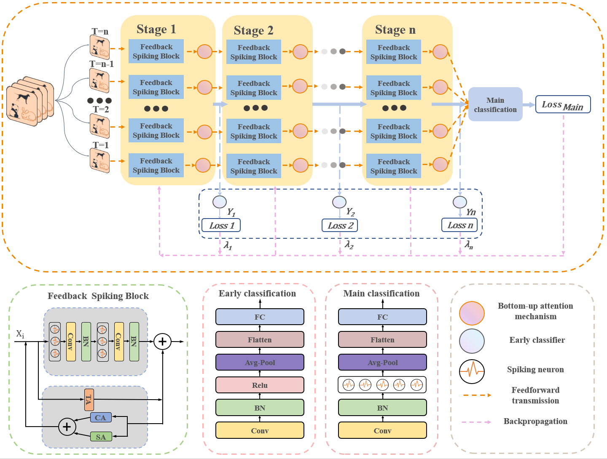

# LNC-SNN
This repository is the official implementation of [LNC-SNN：A Brain-Inspired Layered Neocortex Circuit Spiking Neural Network with Local Learning and Feedback Enhancement].

The code used for the neuromorphic dataset experiments is available at spikingjelly.

## Structure
In this study, we propose a brain-inspired spiking neural network model based on the layered cortical circuitry to simulate the hierarchical information processing mechanisms of the biological neocortex.

## Requirements
`cupy==11.3.0; torch==1.10.2+cu113; spikingjelly==0.0.0.0.12;`

## Main results
| Model                | T      | CIFAR10 Top-1 Acc |CIFAR100 Top-1 Acc|
| :---:                | :---:  |  :---:    |:---: |
|ResNet19  | 4      | 95.12     |76.98  |

| Model                | T      | CIFAR10-DVS Top-1 Acc |DVS-Gesture Top-1 Acc|
| :---:                | :---:  |  :---:    |:---: |
|ResNet19  | 16      | 98.0     |98.26  |
